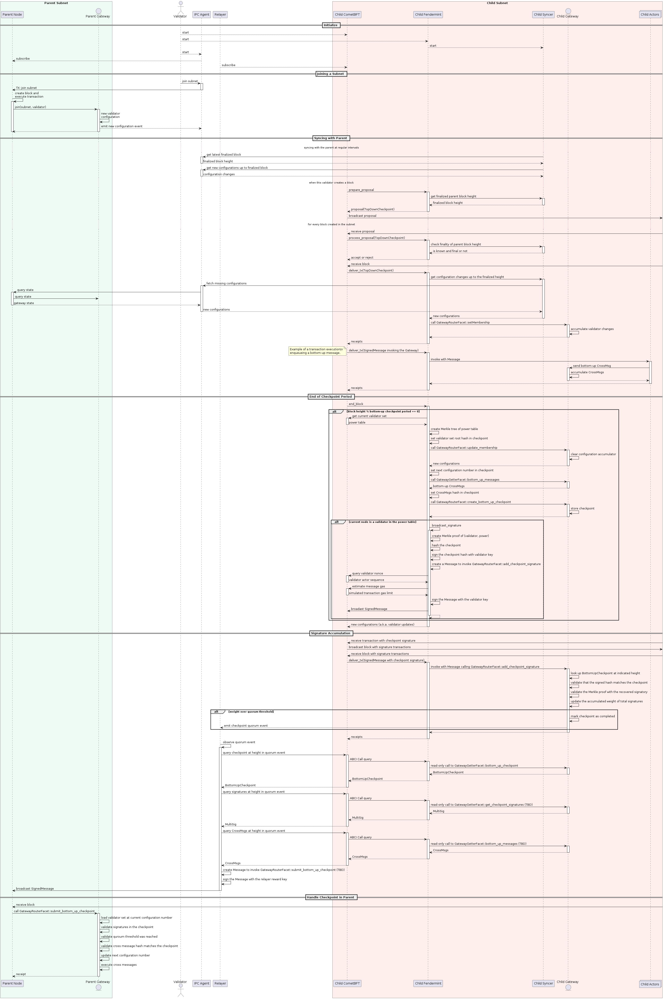

# Checkpointing

Bottom-up checkpoints are periodically submitted to the parent subnet, carrying:
* bottom-up messages
* the next highest configuration number adopted form the validator changesets observed on the parent
* a multi-sig from the current validator set
* the identity of the checkpointed block height

The high level steps are implemented in the [checkpoint](../fendermint/vm/interpreter/src/fvm/checkpoint.rs) module,
which calls various methods on the [Gateway actor](https://github.com/consensus-shipyard/ipc-solidity-actors/tree/dev/src/gateway),
but the end-to-end flow also relies on a working [IPC Agent](https://github.com/consensus-shipyard/ipc/)
and potentially the [IPLD Resolver](https://github.com/consensus-shipyard/ipc-ipld-resolver).

The following diagram illustrates the sequence of events in detail:

The above scenario assumes that the parent subnet is running Lotus, where we are restricted to using Solidity actors,
and therefore the relayers include all bottom-up messages in their transaction, which creates redundancy but makes the
messages trivially available for execution.

If both the parent and the child were Fendermint nodes, we'd have the option to use the IPLD Resolver to only include the CID
of the messages in the relayed checkpoint messages, and let Fendermint make sure the data is available before proposing it
for execution.
