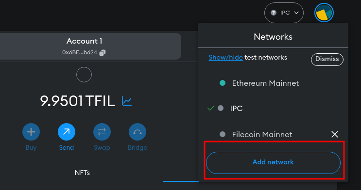
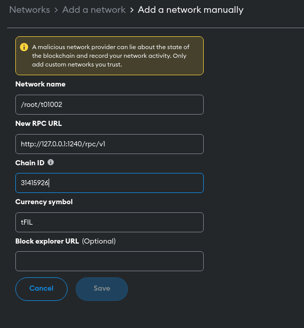

# Working with EVM smart contracts in subnets

IPC subnets have the same exact support for the deployment of EVM contracts as the Filecoin network. We highly recommend refering to [the following docs](https://docs.filecoin.io/smart-contracts/fundamentals/overview/) for a detailed description of FEVM and the steps and tooling to use EVM in Filecoin. In this section, we will present the additional steps required to follow the docs in a subnet.


## Configuring EVM tooling with your subnet

In order to connect the Ethereum tooling to your subnet, you'll need to get the RPC endpoint of your subnet peer and the subnet's `chainID`. For this, you can use the following command from your IPC agent to retrieve the RPC endpoint for a specific subnet: 

```bash
ipc-cli subnet rpc --network <subnet-id>

# Sample command
$ ipc-cli subnet rpc --network /r31415926/t2xwzbdu7z5sam6hc57xxwkctciuaz7oe5omipwbq
rpc: "http://0.0.0.0:8545/"
chainID: "1874254988642837"
```


### Example: Connect Metamask to your subnet

To connect Metamask to your subnet, you need to add it as a new network. To do this you need to: 

- Click `Add network` in networks section of Metamask.



- Add a network manually


- Configure your network by passing to the form the RPC endpoint and `chainID` of your subnet. The `chainID` of IPC subnets will always be `31415926` until [this issue](https://github.com/consensus-shipyard/lotus/issues/178) is implemented.



With this your Metamask should be successfully connected to your subnet, and you should be able to interact with it seamlessly as described in the [Filecoin docs](https://docs.filecoin.io/smart-contracts/fundamentals/overview/).

>💡 Note that your browser may require an HTTPS endpoint or CORS headers. In that case, you may need to perform additional configuration, e.g. deploy a reverse proxy in front of your endpoint.

## Deploying a contract in your subnet

To deploy a smart contract in your subnet the only pre-requirement is to have some funds in the subnet to pay for the gas. To inject funds in your subnet you can follow the steps described [here](./usage.md). 

It is important to note that the IPC agent doesn't understand Ethereum addresses directly, which means that to send funds to an Ethereum address, you will need to send funds to their underlying f4 address. You can use the following command from the IPC agent to get the f4 address for an Ethereum address: 

```bash
ipc-cli util eth-to-f4-addr --addr <eth-adddress>

$ ipc-cli util eth-to-f4-addr --addr 0x6BE1Ccf648c74800380d0520D797a170c808b624
t410fnpq4z5siy5eaaoanauqnpf5bodearnren5fxyoi
```

>💡 For more information about the relationship between `f4` and Ethereum addresses refer to [this page](https://docs.filecoin.io/smart-contracts/filecoin-evm-runtime/address-types/).

From there on, you should be able to follow the same steps currently used to deploy EVM contract in the Filecoin mainnet. You can find here the steps to [deploy an ERC20 contract using Remix](https://docs.filecoin.io/smart-contracts/fundamentals/erc-20-quickstart/).
