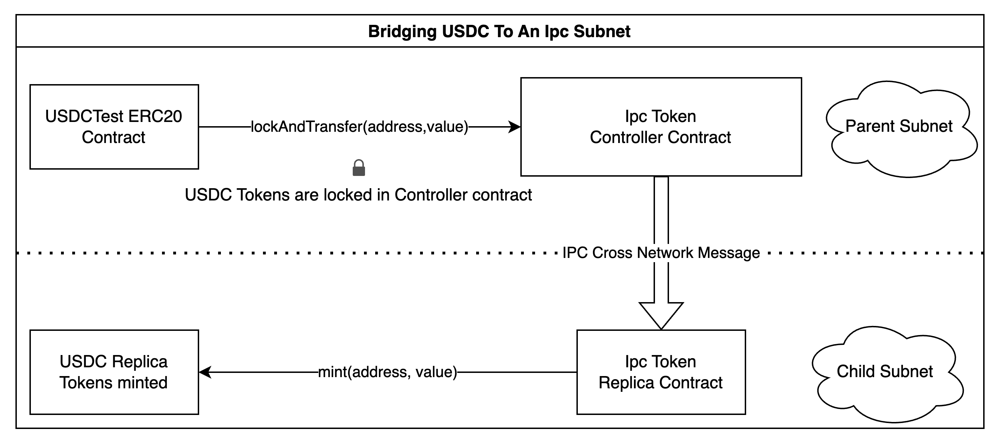
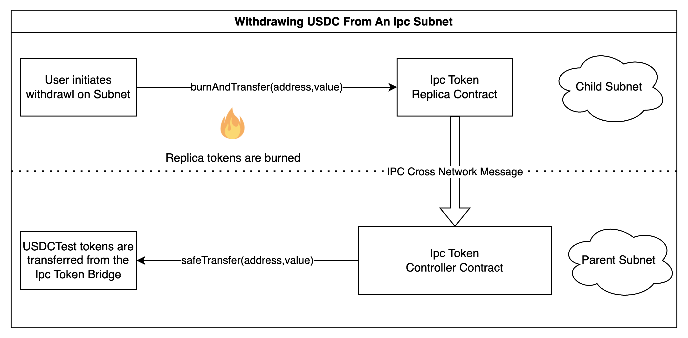

# Linked Token

Replicate a pre-existing ERC20 token from one network (parent) to another (child), using IPC xnet messages to move token units across.
All contracts are upgradable via the OpenZeppelin's Upgrade framework, with scripts provided herein.

## Components

- Linked Token: an abstract contract that handles the common logic, supply/custody semantics, and movements of funds using IPC xnet APIs.
- Linked Token Controller: the contract seated at the parent network, bound to a pre-existing ERC20 token, locking units here and sending mint orders to the subnet, and releasing locked units on burn.
- Linked Token Replica: the contract seated in the child subnet, coupled with the controller on the parent network. It is an ERC20 token in itself, with mint/burn semantics.
- USDCTest: a token merely for test purposes.

## Usage

To deposit N tokens into the subnet:
- Approve the controller to spend N tokens on the holder's behalf.
- Call the `linkedTransfer(address receiver, uint256 amount)` method from an EOA or a contract on the parent.

To withdraw N tokens from the subnet:
- Call the `linkedTransfer(address receiver, uint256 amount)` method from the holder EOA or a contract on the subnet.

## Design

A high-level overview of the process is shown in the following diagrams:





## Deploy and run an example on Calibnet

### Preparation

1. Follow [this guide](https://docs.ipc.space/quickstarts/deploy-a-subnet) to set up a subnet anchored to the Filecoin Calibration network.
2. Copy the config file from `.env.template` to `.env`, and:
    - Set `PRIVATE_KEY` in `.env` for the deployer's address. It needs to have funds both in the parent network and the child subnet. You can use `ipc-cli cross-msg fund` to send funds from the parent to the child subnet.
    - Set `ORIGIN_NET_GATEWAY` to the address of the parent gateway.
    - Set `SUBNET_ROUTE_IN_ETH_FORMAT` to be the Eth address of the subnet actor.

### Deployment

1. Deploy the USDCTest token on Calibnet:

    ```jsx
    make deploy-usdctest
    ```

    Caveat: If you see this error, it's likely that the deployment will have succeeded anyway!

    ```jsx
    Error:
    Transaction dropped from the mempool: 0x563e6ca21d46417020accd05cce992e30f4cb7e69e6b76cc249fea53037bdaa8
    ```

    You can search for the transaction on a Filecoin explorer (e.g. Filfox) and find the correct contract address from the other tab under EthAddress: https://calibration.filfox.info/en/message/0x563e6ca21d46417020accd05cce992e30f4cb7e69e6b76cc249fea53037bdaa8?t=4

2. Mint 1000 USDCTest tokens to your wallet on the parent.

    ```jsx
    make mint-usdc
    ```

3. Check your wallet balance to ensure that the mint was successful.

    ```jsx
    make check-balance
    ```

    ```jsx
    0x00000000000000000000000000000000000000000000000000000000000003e8
    ```

    If it's still zero, wait a few more seconds before retrying.

4. Deploy the Token Replica contract on the subnet. This command should execute fairly quickly because of the subnet's speed. Use the contract address from the printout indicated below.

    ```jsx
    make deploy-replica
    ```

5. Deploy the Token Controller contract on Calibnet and update our `.env` file with the new address.

    ```jsx
    make deploy-controller
    ```

6. Now, we must update the Token Replica with the Controller's address, and vice versa ("rendezvous").

    ```jsx
    make initialize-replica
    ```

    ```jsx
    make initialize-controller
    ```


### Depositing tokens into the subnet

1. Approve the Token Controller contract to handle our funds:

    ```jsx
    make approve-usdc
    ```

2. With approval, to deposit 1000 USDCTest tokens we do the following:

    ```jsx
    make deposit-usdc
    ```

3. Confirm our balance on Calibnet has gone to zero:

    ```jsx
    make check-balance
    ```

    If it's still zero, wait a few more seconds before retrying.

4. You need to wait until the subnet has imported the finalized parent chain where the deposit was performed. Validate that our Token Replica balance is the correct value by running the command.

    ```jsx
    make check-replica-balance
    ```

    looking for a value of:

    ```jsx
    0x00000000000000000000000000000000000000000000000000000000000003e8
    ```


### Withdraw token from the subnet

In order to withdraw tokens from the subnet we must ensure we're running a checkpoint relayer with the command. See [this guide](https://docs.ipc.space/quickstarts/deploy-a-subnet) for more info.

Then running this command will initiate the withdrawal in the subnet.

```jsx
make withdraw-usdc
```

After the withdrawal has been committed to the parent in the next checkpoint, we can validate our funds are correctly transfered with `make check-replica-balance` and `make check-balance`.
