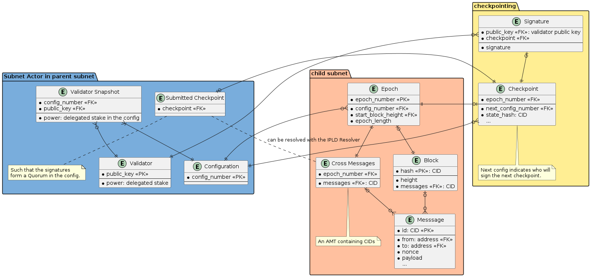
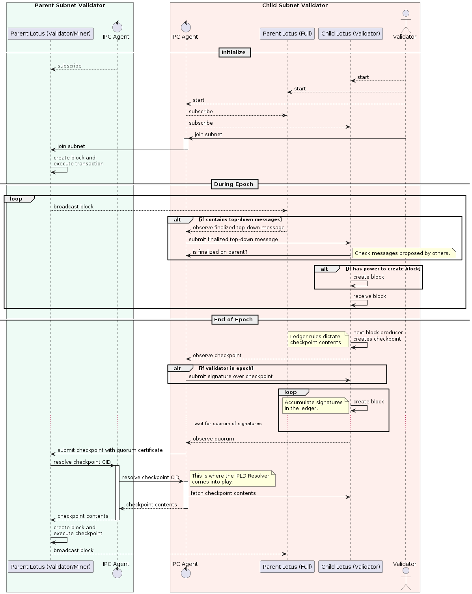
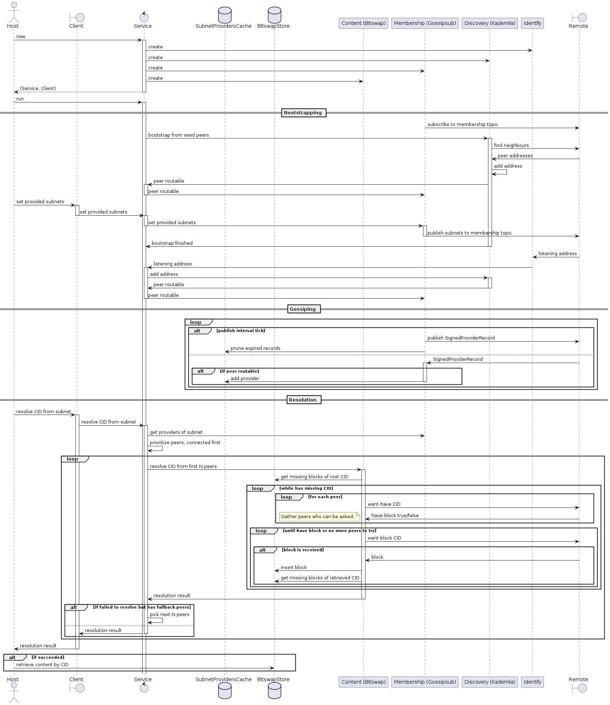

# IPLD Resolver

The IPLD Resolver is a library that [IPC Agents](https://github.com/consensus-shipyard/ipc/) can use to exchange data between subnets in IPLD format.

## Checkpointing

The most typical use case would be the propagation of checkpoints from child subnets to the parent subnet.

### Checkpoint Schema

One possible conceptual model of checkpointing is depicted by the following Entity Relationship diagram:



It shows that the Subnet Actor in the parent subnet governs the power of validators in the child subnet by proposing _Configurations_, which the child subnet is free to adopt in its _Epochs_ when the time is right, communicating back the next adopted config via _Checkpoints_.

At the end of an epoch, the validators in the child subnet produce a checkpoint over some contents, notably the cross-messages they want to propagate towards the parent subnet. Through the cross-messages, the checkpoint indirectly points to individual messages that users or actors wanted to send.

Once enough signatures are collected to form a Quorum Certificate over the checkpoint (the specific rules are in the jurisdiction of the Subnet Actor), the checkpoint is submitted to the parent ledger.

However, the submitted checkpoint does not contain the raw messages, only the meta-data. The content needs to be resolved using the IPC Resolver, as indicated by the dotted line.

### Checkpoint Submission and Resolution

The following sequence diagram shows one possible way how checkpoints can be submitted from the child to the parent subnet.

It depicts two validators: one only participating on the parent subnet, and the other on the child subnet; the latter has to also run at least a full node on the parent subnet. Both validators run one IPC Agent each.

The diagram shows that at the end of the epoch the child subnet validators produce a Quorum Certificate over the checkpoint, which some of their agents submit to the parent subnet.

After that, the parent subnet nodes reach out to their associated IPC Agent to resolve the messages referenced by the checkpoint, which the Agent does by communicating with some of its child-subnet peers.



This is just a high level view of what happens during message resolution. In the next section we will delve deeper into the internals of the IPLD Resolver.


## IPLD Resolver Sub-components

The IPLD Resolver uses libp2p to form a Peer-to-Peer network, using the following protocols:
* [Ping](https://github.com/libp2p/rust-libp2p/tree/v0.50.1/protocols/ping)
* [Identify](https://github.com/libp2p/rust-libp2p/tree/v0.50.1/protocols/ping) is used to learn the listening address of the remote peers
* [Kademlia](https://github.com/libp2p/rust-libp2p/tree/v0.50.1/protocols/kad) is used for peer discovery
* [Gossipsub](https://github.com/libp2p/rust-libp2p/tree/v0.50.1/protocols/gossipsub) is used to announce information about subnets the peers provide data for
* [Bitswap](https://github.com/ipfs-rust/libp2p-bitswap) is used to resolve CIDs to content

See the libp2p [specs](https://github.com/libp2p/specs) and [docs](https://docs.libp2p.io/concepts/fundamentals/protocols/) for details on each protocol, and look [here](https://docs.ipfs.tech/concepts/bitswap/) for Bitswap.

The Resolver is completely agnostic over what content it can resolve, as long as it's based on CIDs; it's not aware of the checkpointing use case above.

The interface with the host system is through a host-provided implementation of the [BitswapStore](https://github.com/ipfs-rust/libp2p-bitswap/blob/7dd9cececda3e4a8f6e14c200a4b457159d8db33/src/behaviour.rs#L55) which the library uses to retrieve and store content. Implementors can make use of the [missing_blocks](../src/missing_blocks.rs) helper method which recursively collects all CIDs from an IPLD `Blockstore`, starting from the root CID we are looking for.

Internally the protocols are wrapped into behaviours that interpret their events and manage their associated state:
* `Discovery` wraps `Kademlia`
* `Membership` wraps `Gossipsub`
* `Content` wraps `Bitswap`

The following diagram shows a typical sequence of events within the IPLD Resolver. For brevity, only one peer is shown in detail; it's counterpart is represented as a single boundary.



# Diagram Automation

The diagrams in this directory can be rendered with `make diagrams`.

Adding the following script to `.git/hooks/pre-commit` automatically renders and checks in the images when we commit changes to the them. CI should also check that there are no uncommitted changes.

```bash
#!/usr/bin/env bash

# If any command fails, exit immediately with that command's exit status
set -eo pipefail

# Redirect output to stderr.
exec 1>&2

if git diff --cached --name-only  --diff-filter=d | grep .puml
then
  make diagrams
  git add docs/diagrams/*.png
fi
```
